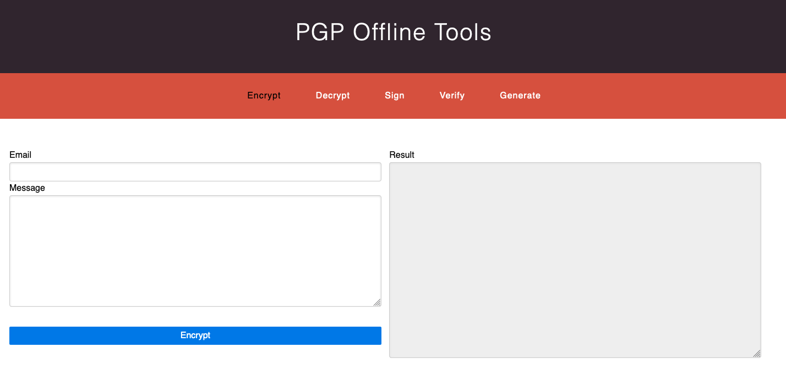

# PGP Offline Tools

[](https://github.com/leakira)
[](LICENSE)

A completely offline way to manage PGP features



## How to use
- Clone this project
- Add your private keys and public keys in the "/keys" folder
- Open any of project HTML files
- Done!

## Features
- Generate new PGP key pairs (generate.html)
- Encrypt message (encrypt.html)
- Decrypt message (decrypt.html)
- Sign message (sign.html)
- Verify message signature (verify.html)

## Tests
You can use test@test.com key pairs to test the features:
- Name: **Test**
- E-mail: **test@test.com**
- Passphrase: **test**

## Used libraries
### CSS
- [Pure CSS 1.0.0](https://purecss.io/)

### JS
- [jQuery 3.4.1](https://jquery.com/)
- [OpenPGP.js 4.5.0](https://openpgpjs.org/)

## Tested on browsers
- Firefox
- Google Chrome*
- Safari*

## Running on Google Chrome
Google Chrome blocks local file request, used to retrieve the stored keys. To enable, run this command from terminal/prompt:
- For Windows:
```
chrome.exe --allow-file-access-from-files
```

- For macOS:
```
open /Applications/Google\ Chrome.app/ --args --allow-file-access-from-files
```

- For Linux:
```
chromium-browser --allow-file-access-from-files
```

## Running on Safari
Safari, same as Chrome, blocks local file request. To enable, check the option "Disable local file Restrictions" from Developer menu.

## License
This project is licensed under the MIT License - see the [LICENSE](LICENSE) file for details
